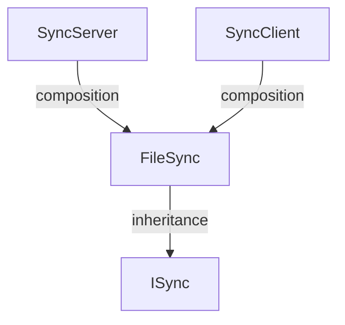

# FileSync Specification

## Requirements

To develop a file synchronization module for the Cop project with the following features:

1. Allow any module (Incident Management, Whiteboard, Cloud, etc.) to share files from its local folder with other cops using a single button click.
2. Synchronize **large files** (images, videos, documents, whiteboard exports) over the LAN. Small structured data such as incident records is stored in the Cloud and is **out of scope**.
3. Transfer only what is needed: new or changed files are pulled, unchanged files are skipped.
4. Never silently lose a cop's work when two cops edit the same file independently.
5. Expose a small, stable API so other modules integrate without knowing anything about sockets, manifests or conflict logic.
6. Report progress, results and conflicts back to the calling module so that it can display them in its own UI.

 

---

## Basic Class Diagram 

---

